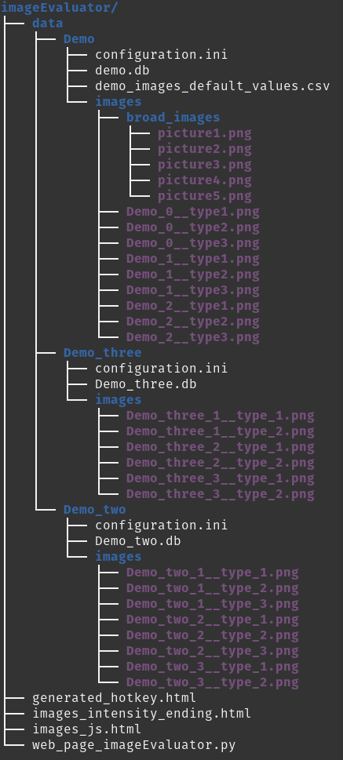

# Image Evaluator
A tool for generating a web page to let evaluaters answer question for images. The imageEvaluator stores the responces to in a SQLite database and/or comma-separated values (csv) file.

## Getting started
Each questionnaire in imageEvaluator has it's own directory in the data directory with 
- a configuration.ini file
- images directory with images for the questionnaire
- *(optional)* a `<name_of_questionnaire>_images_default_values.csv` that maps images to specified display values (image mapper)
- *(optional)* images/broad_images directory for additional images for more information/context for the images specified in the *image mapper*
  
  
  *ImageEvaluator Questionnaire Directory Example Structure*

### Images:
In the images folder store your images that need to be rated following this namingstructure for each image:
{sample_name}__{type}.{extension} or navigate to the imageEvaluator directory and use the mkquest.sh command in the terminal to make a new questionnaire.

### Questions:
In the configurations.ini file of the questionnaire add your questions under [Questions] and above [End_questions]:
```ini
[QUESTIONS]
  [Question0]
  Question_type = text_input
  Question_discription = Enter optional comment.

  [question1]
  Question_type = selection_box
  Question_discription = selectionbox question
  Options = option1, option2, option3
```
Or bind a hotkey to an answer by adding <'keystroke> after an option in Options
```ini
  [question2]
  Question_type = multiple_choice
  Question_discription = multiple_choice_question
  Options = option1 <1>, option2 <2>, option3 <3>
[End_questions]

```

### Further Configurate:
In the configurations.ini file other adjustments can be done like:
image_display, database storage, extra text, ...

### Optional Image mapping:
A csv file with mappings to images can be added to the questionnaire directory where images 
can be maped to values like: size, broad image (for extra context), location, scale bar, ...
If the image can not be found in the questionnaire the values of the image will be set to the values of the configuration.ini file. 

Make sure the csv file for mapping the images is in the following form:
  
  - **name of the file:** `<name_of_questionnaire>_images_default_values.csv`
  
  - **example of content of the file:**

    

  - **Explanation of collums**:
    - **id**: Name of image where the following variables apply.

    - **size**: an integer for the image size.

    - **broad_image**: Name of broad image found in the  "*~/imageEvaluator/data/<name_of_questionnaire>/images/broad_images/*"    directory that will be renderd when the "id images" are displayed.

    - **location**: Coordinates of the red square that will be drawn on the "broad_image", an input value of  this collum has the following form:
int,int,int,int   (which specifies a diagonal of the "red square").

    - **scale_bar_text**: text of the scale bar

    - **scale_bar_length**: the length of the desired scale bar in pixels on the original image.
  
  
  
## Generating the web page:
when images, questions and other adjustments are made run following streamlit command to render webpage:
```bash
streamlit run web_page_imageEvaluator.py
```
